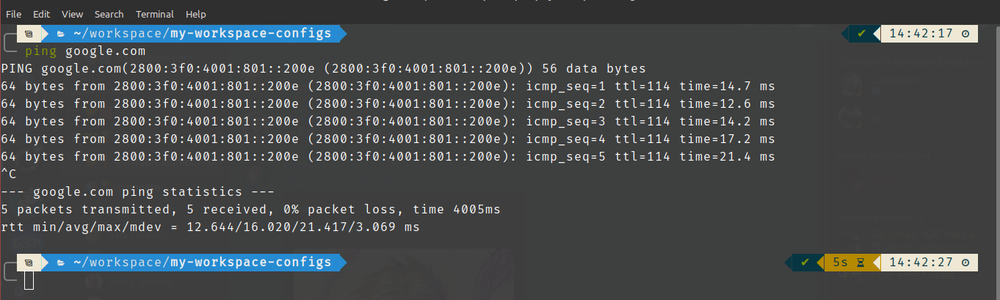
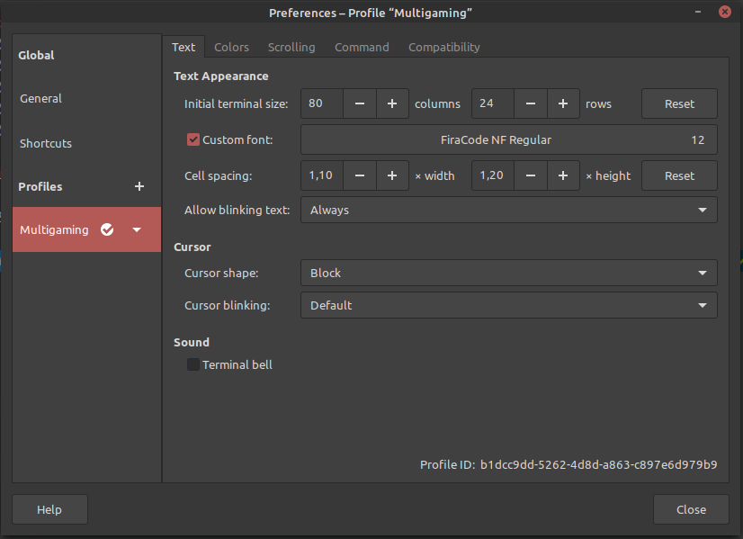

# Terminal

## 1.Final Result


<br>   

## 2. Steps

1. Install [ZSH](https://github.com/ohmyzsh/ohmyzsh/wiki/Installing-ZSH).
2. Install [Oh my ZSH](https://ohmyz.sh/). Remember to set ZSH as your default terminal and reboot your system.
3. Install [Zinit](https://github.com/zdharma/zinit).
4. Install the [Powerlevel10k](https://github.com/romkatv/powerlevel10k#oh-my-zsh).
5. Download and install your favorite font. See the [recommended fonts](https://github.com/romkatv/powerlevel10k#meslo-nerd-font-patched-for-powerlevel10k) of Powerlevel10k. I do prefer the [Firecode font](https://drive.google.com/file/d/1RVB9zk8TC6dzQUFm0CjTveNB-I197Bb5/view?usp=sharing).
6. Use this command to edit your .zshrc file: 
```bash
$ nano ~/.zshrc
```
7. And paste this configs at end of file:
```terminal
zinit light zdharma/fast-syntax-highlighting
zinit light zsh-users/zsh-autosuggestions
zinit light zsh-users/zsh-completions
zplugin ice depth=1; zplugin light romkatv/powerlevel10k
```
8. Set your favorite font on your terminal. In my case is the Firecode NF font Regular.



9. Run the command ```p10k configure``` to configure your terminal.
10. Have fun!